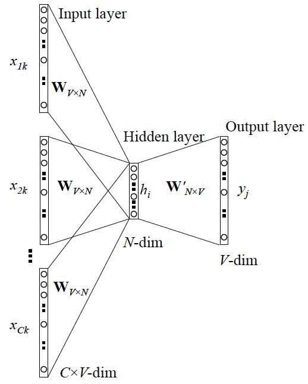
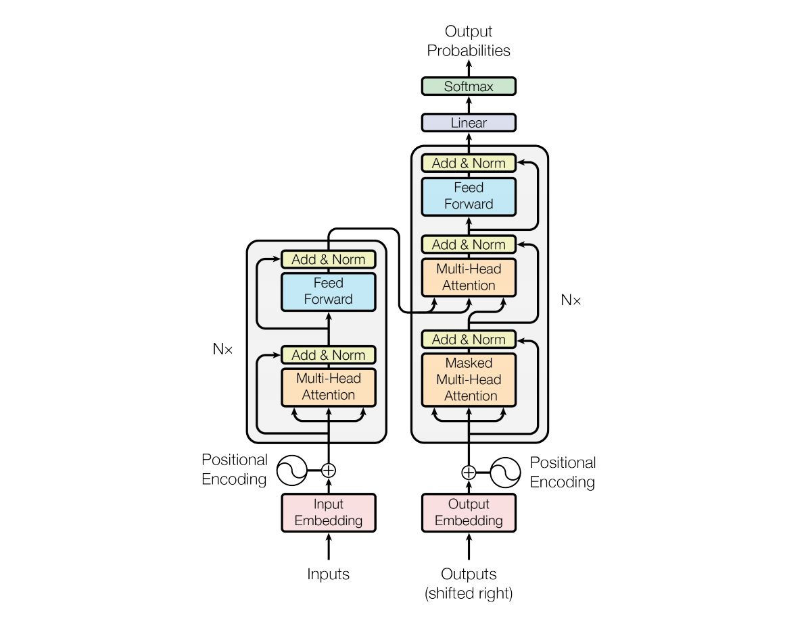

# NLP面试知识汇总

### 1. ngram模型
  是一种统计语言模型。常用的有unigram(1-gram),bi-ngram,tri-gram。
  理论依据：
    ngram根据概率公式推导，依据条件概率和乘法公式，假设有两个词A和B，在A后出现B的概率为:$$p(B|A)=\frac{p(AB)}{p(A)}$$上述式子可解释为在$A$同时出现时$AB$同时出现的概率，有$$p(B|A)=\frac{c(AB)}{c(A)}$$其中$c(AB)$为文中$AB$出现的次数，$c(A)$为$A$出现的次数。
  变为乘法公式有:$$p(AB)=p(B|A)p(A)$$从而得到ngram概率公式：$$p(A_1A_2...A_n)=p(A_1)p(A_2|A_1)p(A_3|A_2A_1)...p(A_n|A_{n-1}...A_1)$$引入马尔科夫假设，即当前词的出现仅与之前几个词有关。即：
  $$p(A_1,A_2,...A_n)=p(A_i|A_{i-m+1}...A_{i-1})$$ngram模型中n的影响:
    * n变大时：对下一个词的约束性信息增大，更大的辨别力，更稀疏，并且n-gram统计的的总数更多，为$[word-num^V]$个。
    * n变小时：高频词次数更多，统计结果更可靠，更高的可靠性 ，但是约束信息更少。

n为特定值时，假设$|V|=2e4$，统计次数为：
| n |ngram个数|
|:--:|:------:|
| 1 |   4e8 |
| 2 |   8e12|
| 3 |  1.6e17|

### 2. word2vec

NLP中，最细粒度的是 __词__，词组成 __句子__，句子组成 __段落、篇章、文档__。而word2vec就是表征词的技术。
 *__为什么要有Word2vec？？？__*
利用模型处理需要将文本转换成数值形式，即嵌入到一个数学空间，这种嵌入方式，就叫词嵌入 __word embedding__，而 __*Word2vec*__ 就是词嵌入 __word embedding__ 的一种，是一种无监督预训练方法。
 Word2vec的两个学习方式 : Skip-gram和CBOW 

> word2vec到底怎样训练：
答：上述可知，处理文本需要将文本转换为可处理的数值形式，也就是利用词袋模型，转换为one-hot形式输送入模型进行训练，而在模型处理的过程中，会对one-hot进行一系列的线性或非线性变换，而在one-hot向量线性变换且降维操作中得到的产物，就是最终需要的词向量，也就是该层的权重。

#### Skip-gram
利用中心词预测上下文，一般为上下两个词。目标函数形式化为 __最大化对数似然函数__:
$$Aim \ fun=\sum_{w \in C}log \ p(Context(w)|w)$$

图中 $W_{V*N}$ 即最终需要的整张词表，假设有 $x_i=[0,0,1,...,0]^T
 \in R^{1e5}$, 词表大小为 $W_{1e5*768}$，表示为$1e5$个词，每个词768维向量。$x_i*W_{1e5*768}$就会得到$W$中第2行的向量，用以表征$x_i$，维度从$1e5$下降到768维。

 #### CBOW
 如图所示，训练方式为利用上下文词预测中心词。目标函数形式化为 __最大化对数似然函数__:
 $$Aim \ fun=\sum_{w \in C}log \ p(w|Context(w))$$

#### word2vec训练trick

##### 知识补充 *霍夫曼树*

------
原理来源：__Huffman编码__:一种用于无损数据压缩的熵编码（权编码）算法。
&nbsp;&nbsp;&nbsp;&nbsp;&nbsp;&nbsp;&nbsp;目标：*__出现概率高的符号使用较短的编码，出现概率低的符号则使用较长的编码。__*
数据结构：__最优二叉树__，表示一种带权路径长度 __最短的二叉树__。带权路径长度，指的就是叶子结点的权值乘以该结点到根结点的路径长度。

-------
##### $hierarchical \ softmax$ 分层softmax
霍夫曼树在 _word2vec_ 中的应用就是首先将词典中的每个词按照词频大小构建出一棵 _Huffman_ 树，即用于后续的$softmax$:
* 保证词频大处于浅层，词频低处于深层，每一个词都处于这棵 _Huffman_ 树上的某个叶子节点。
* 将原本的一个$|V|$分类问题变成了$log_2|V|$次的二分类问题。原先要计算$p(w_tc_t|)$的时候,普通$softmax$要求词典中每个词的概率大小。在$Hierachical Softmax$中，只需要把它变成在$Huffman$树中的路径预测问题就可以了，因为当前词$w_c$在$Huffman$树中对应到一条路径，这条路径由这棵二叉树中从根节点开始，经过一系列中间的父节点，最终到达当前这个词的叶子节点而组成，那么在每一个父节点上，都对应的是一个二分类问题。

##### $negative \ sampling$ 负采样
普通$softmax$的计算量太大是因为把词典中所有其他非目标词都当做负例，而负采样的思想是 每次按照一定概率随机采样一些词当做负例，从而就只需要计算这些负采样出来的负例，那么概率公式便相应变为：$$p(w_t|c_t)=\frac{exp(e^{'}(w_t)^Tx))}{\sum_{i=1}^{K}exp^{'}(w_i)^Tx} \quad x=\sum_{i \in c}e(w_i) $$ 与普通 $softmax$ 进行比较会发现，将原来的$|V|$分类问题变成了$K$分类问题。

> ### 预训练模型问题

####  Transformer模型结构

和大多数seq2seq模型一样，transformer的结构也是由encoder和decoder组成。

* Encoder
    每个Layer由两个sub-layer组成，分别是multi head self attention mechanism和fully connected feed-forward network。其中每层都加了residual connection和layer normalisation，因此可以将sub-layer的输出表示为：$$sub\_layer\_output = Layer\ norm(x+SubLayer(x))$$
        * Multi-head self-attention
        $$MultiHead=Concat(head_1,head_2,...,head_n)W^o$$$$head_i=Attention(QW_{qi}^{T},KW_{ki}^{T},VW_{vi}^{T})$$$$Attention(QW_{qi}^{T},KW_{ki}^{T},VW_{vi}^{T})=softmax(\frac{QW_{qi}^{T}(KW_{ki}^{T})^T}{\sqrt{d_k}})VW_{vi}^{T}$$
        * Position-wise feed-forward networks
        提供非线性变换，相当于MLP层
* Decoder
  * 输入：$i$时刻的输入为encoder的输出和$i-1$时刻decoder的输出。$0$时刻decoder的输入为句子的开始字符。所以中间的attention不是self-attention，它的$K$，$V$来自encoder，$Q$来自上一位置decoder的输出
  * 输出：对应$i$位置的各词的概率。
  * 解码：训练和预测是不一样的，可参考seq2seq。在训练时，解码是一次全部decode出来，用上一步的ground truth来预测（mask矩阵也会改动，让解码时看不到未来的token）；而预测时，因为没有ground truth了，需要一个个预测。

####  Transformer的输入和输出分别是什么？
__输入__： Token Embeddings + Segment Embeddings + Position Embeddings
Token Embeddings ： 字向量，即每个字的表示
Segment Embeddings ：表示当前字在第几个句子，对应Bert的NSP任务
Position Embeddings ：位置向量表示

Position Embeddings:
论文中采用：_用不同频率的sine和cosine函数直接计算_，公式为：$$PE_{pos,2i}=sin(pos/10000^{2i/d_{model}})$$$$PE_{pos,2i+1}=cos(pos/10000^{2i/d_{model}})$$优点：
1. 任意位置的$PE_{pos+k}$都可被$PE_{pos}$的线性函数表示

####  BERT的输入和输出分别是什么？
__输入：__ Token Embeddings + Segment Embeddings + Position Embeddings
_Token Embeddings_ ： 字向量，即每个字的表示
_Segment Embeddings_ ：表示当前字在第几个句子，对应Bert的NSP任务
_Position Embeddings_ ：位置向量表示

####  不考虑多头的原因，$self \ attention$中词向量不乘$QKV$参数矩阵，会有什么问题？
$self \ attention$ __核心__ 是 *用文本中的其它词来增强目标词的语义表示，从而更好的利用上下文的信息。*
计算过程中一般会有 $q=k=v$，相等实际上指来自同一个基础向量。在实际计算时，因为乘了参数矩阵，$q,k,v$一般不相等。
那如果不乘，每个词对应的$q,k,v$就是完全一样的。相同量级的情况下，$q_i$与$k_i$点积的值会是最大的。在$softmax$后的加权平均中，$w_i$词本身所占的比重将会是最大的，使得其他词的比重很少，无法有效利用上下文信息来增强当前词的语义表示。而乘以参数矩阵后，会使得每个词的$q,k,v$都不一样，能很大程度上减轻上述的影响。

#### BERT的mask方式？
__BERT的mask方式__ ：选择mask的 _15%_，并且其中有 _80%_ 情况下使用mask掉这个词，_10%_ 情况下采用一个任意词替换，剩余 _10%_ 情况下保持原词汇不变。
为什么要mask 15%，而不是其它数值？为什么15%中还要分为80%mask，10%替换，10%保持？
原 __论文__ 中表示是受到 __*完形填空*__ 的启发。 而$p=0.15$的一个解释为:在一个大小为$1/p=100/15\approx 7$的窗口中随机选一个词，类似CBOW中滑动窗口的中心词。
而分为 _80%mask，10%替换，10%保持_ 的原因：
* 80%mask主要是保证模型能利用上下文预测该位置的词。
* 10%的概率用任意词替换去预测正确的词，相当于文本纠错任务，为BERT模型赋予了一定的文本纠错能力。
*   10%的概率保持不变，缓解了finetune时候与预训练时候输入不匹配的问题(预训练时候输入句子当中有mask，而finetune时候输入是完整无缺的句子，即为输入不匹配问题)。

__缺点:__
* 针对有两个及两个以上连续字组成的词，随机mask字割裂了连续字之间的相关性，使模型不太容易学习到词组的语义信息。
* 就是每批次数据中只有 15% 的标记被预测，这意味着模型可能需要更多的预训练步骤来收敛。

####  使用BERT预训练模型为什么最多只能输入512个词，最多只能两个句子合成一句？
可以更改 _BERT config_，设置更大 _max_position_embeddings_ 和 _type_vocab_size_ 值去满足自己的需求。

####  为什么BERT在第一句前会加一个[CLS]标志？或者者说[CLS]位置的作用？
加一个[CLS]标志，最后一层该位对应向量可以作为整句话的语义表示，从而 __用于下游任务__。无明显语义信息的符号 会更“公平”地融合文本中各个词的语义信息，从而更好的表示整句话的语义。
具体来说，$self \ attention$用文本中的其它词来增强自身所蕴含的语义信息，但是本身的语义会占主要部分，因此，[CLS]位本身没有语义，经过12层，得到的是融合所有词的加权平均信息，相比其他正常词，可以更好的表征句子语义。

####  $Self \ Attention$ 的时间复杂度是怎么计算的？
$Self \ Attention$时间复杂度:$O(n^2d)$，这里，$n$是序列的长度，$d$是$embedding$的维度。
三个步骤：相似度计算，$softmax$和加权平均，时间复杂度分别是：
相似度计算为$Q \in R^{n*d}$和$K\in R^{d*n}$的两个矩阵相乘：$(n,d)*(d*n)=O(n^2d)$ ，得到一个$(n*n)$的矩阵
为何相似度计算复杂度为：$O(n^2d)?$
* $Q$矩阵的每行会和$K$矩阵的每列对应相乘相加，所以$row*col$的复杂度为$d$（维度）。
* $Q$和$K$分别有$n$行和$n$列，执行$n*n$次第一条的操作。
* 综上，时间复杂度为$O(n^2d)$

$softmax$时间复杂度为：$O(n^2)$
加权平均可以看作大小为$(n,n)$和$(n,d)$的两个矩阵相乘，得到一个$(n,d)$的矩阵，复杂度为$O(n^2d)$
为何相似度计算复杂度为：$O(n^2d)?$ _与相似度计算复杂度有区别_
* $(n,n)$相似度矩阵的每行会和$V$矩阵的每列对应相乘相加，所以$row*col$的复杂度为$n$(行和列的维度)。
* $(n,n)$和$V$分别有$n$行和$d$列，执行$n*d$次第一条的操作。
* 综上，时间复杂度为$O(n^2d)$

综上，$Self \ Attention$ 的时间复杂度是$O(n^2d)$。

####  $Multi\ head \ Self \ Attention$ 的时间复杂度是怎么计算的？

借鉴$Self \ Attention$时间复杂度的计算，多头注意力在代码中是$transposes \ and \ reshapes$。怎么理解？
代码中将$embedding$的维度做了$transposes$，即$dim=head*per\_head\_dim$，此时的维度为$[batch\_size,\ text\_length,\ \textcolor{red}{head},\ per\_head\_dim]$， 然后$reshapes$，即维度变为$[batch\_size,\ \textcolor{red}{head},\ text\_length,\ per\_head\_dim]$。
此时单样本的复杂度计算为：
* 相似度计算：$Q\in R^{head*text\_length*per\_head\_dim}*K^T\in R^{head*per\_head\_dim*text\_length}=O(head*text\_length^2*per\_head\_dim)$，由于$dim=head*per\_head\_dim$，所以复杂度为$O(text\_length^2dim)$，即$O(n^2d)$，后续$softmax$计算与加权平均计算的复杂度同理。最后可得$Multi\ head \ Self \ Attention$复杂度与$Self \ Attention$复杂度一样，都为$O(text\_length^2dim)$，即$O(n^2d)$。
